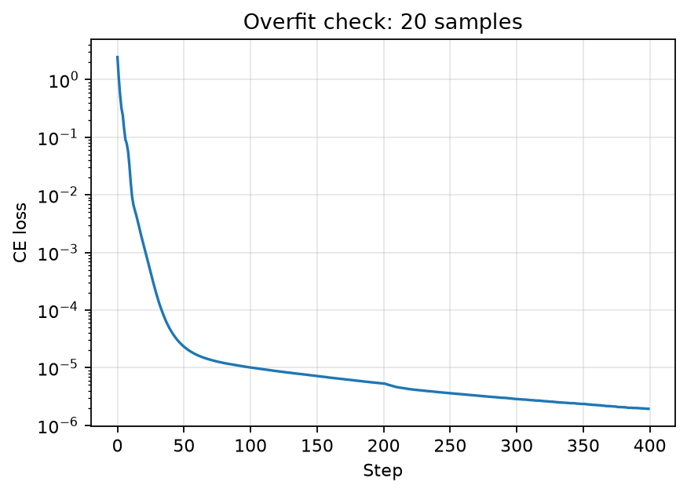
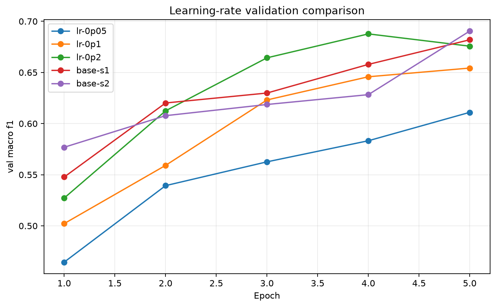
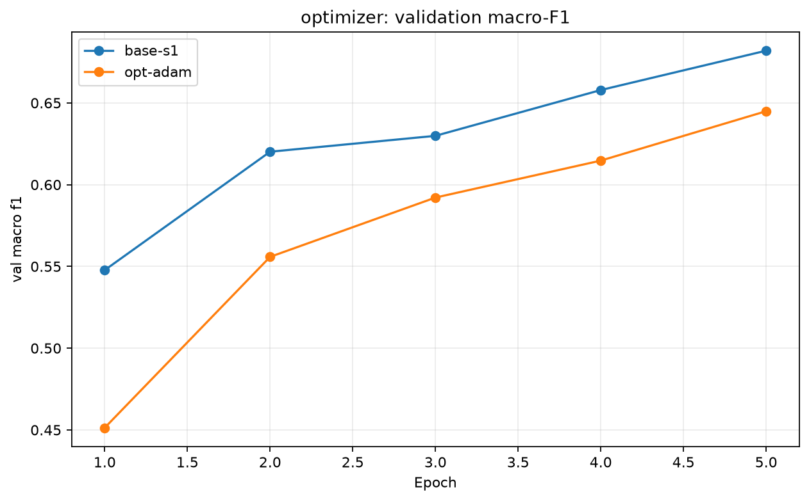
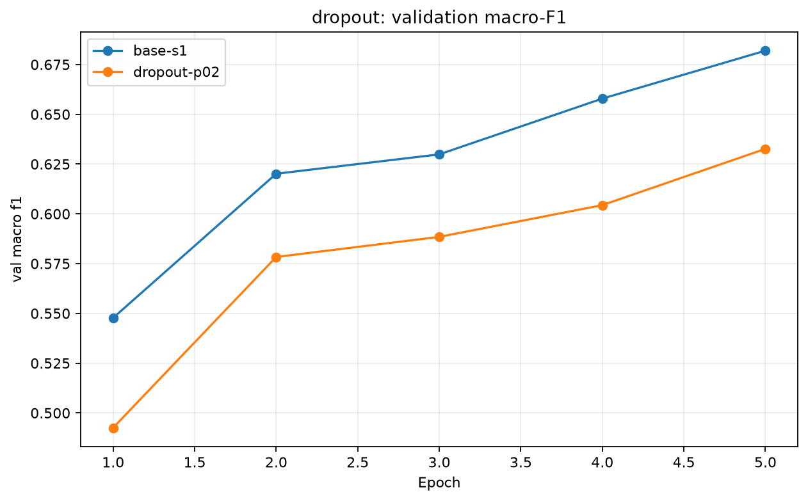
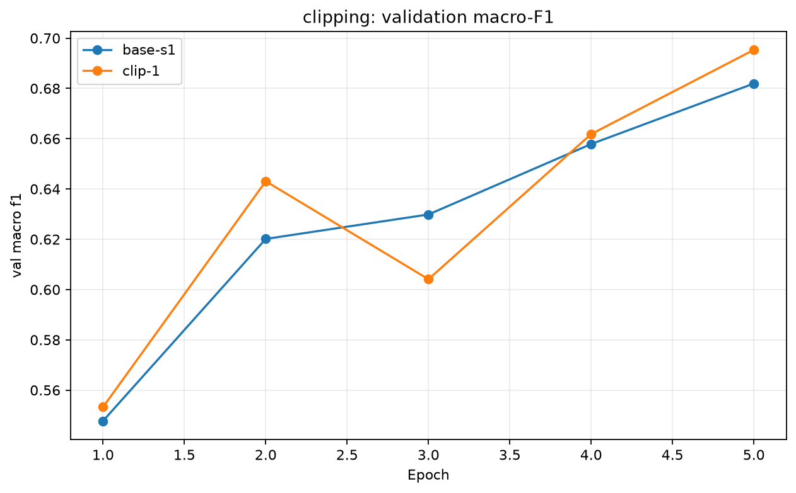
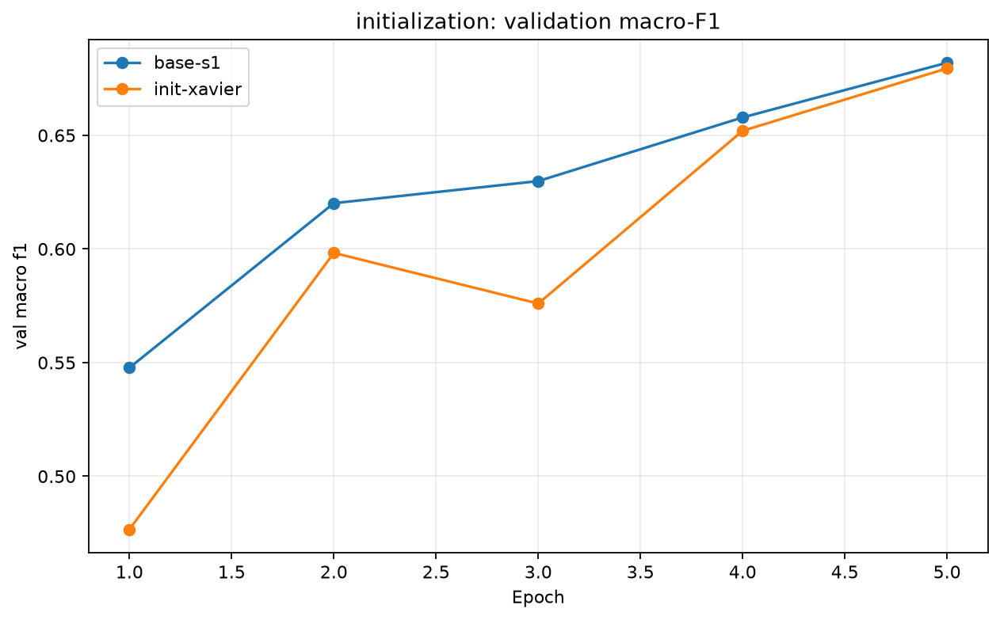
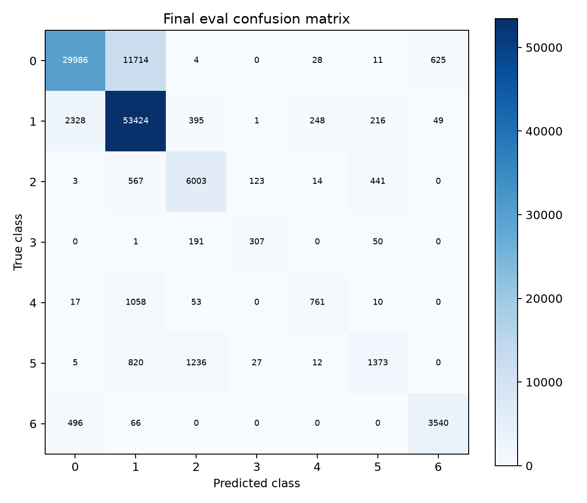

# Báo cáo Lab Day 1 — MSSV: thay bằng MSSV của sinh viên

## 1. Thiết lập

Tôi chạy trên PyTorch 2.14.1, CPU 8 luồng. Dữ liệu Forest CoverType được chia cố định theo `split_metadata.csv`: 371,847 mẫu train, 92,962 validation và 116,203 eval. Validation được tách phân tầng với seed 42. Mười cột số được chuẩn hoá theo train, có trung bình xấp xỉ 0 và độ lệch chuẩn xấp xỉ 1.

Mô hình là M-base, `54 → 256 → 128 → 7`, ReLU, 47,879 tham số, logits thô và Cross Entropy. Vì chỉ có CPU, toàn bộ các cấu hình thí nghiệm dùng đồng nhất 5 epoch và batch 4,096; train loss được đo trên một tập monitor cố định 50,000 mẫu, còn validation được đo trên toàn bộ 92,962 mẫu. Baseline là SGD momentum 0.9, He init, không dropout và không clipping. Accuracy của bộ đoán luôn lớp đa số trên validation là 0.4876.

## 2. Kiểm tra ban đầu và nhiễu seed

| Kiểm tra | Kết quả |
|---|---:|
| Tham số / logits | 47,879 / `(8, 7)` |
| Step-0 loss, base-s1 | 2.2691; `ln(7)=1.9459` |
| Quá khớp 20 mẫu | CE cuối nhỏ hơn 0.05 sau 400 bước |
| Gradient | Tất cả 6 tensor tham số có gradient khác 0 |
| Baselines | base-s1 và base-s2 |
| Validation accuracy | 0.8260 ± 0.0106 |
| Validation macro-F1 | 0.6742 ± 0.0231 |

Step-0 loss cao hơn `ln(7)` 0.3232 vì He initialization tạo logits có phương sai hữu hạn, nên softmax chưa hoàn toàn đều. Tuy nhiên loss vẫn cùng bậc với `ln(7)`, mô hình có shape đúng, và bài kiểm tra 20 mẫu giảm loss xuống gần 0. Các gradient khác 0 xác nhận đường truyền ngược hoạt động. Ngưỡng nhiễu dùng trong so sánh là `2σ = 0.0461` macro-F1.

## 3. Thí nghiệm theo validation

Mọi quyết định dưới đây chỉ dùng validation. Bảng đầy đủ, gồm cấu hình và lịch sử kết quả, ở `experiments.xlsx`.

### Learning rate

Dự đoán: learning rate cao hơn sẽ hội tụ nhanh hơn trong ngân sách 5 epoch, nhưng quá cao có thể dao động. Với SGD momentum, LR 0.05/0.10/0.20 đạt macro-F1 lần lượt 0.6110/0.6543/0.6757. Vì vậy LR 0.20 được chọn cho baseline. Đường cong cho thấy trong khoảng đã thử, LR 0.20 chưa gây divergence.

### Optimizer

Adam được thử với LR 0.001, được chỉnh riêng bằng validation để không dùng nguyên LR của SGD. Kết quả `opt-adam` là 0.6449 macro-F1, thấp hơn trung bình baseline 0.0292 và không vượt ngưỡng 2σ. Adam không có lợi thế trong ngân sách và batch này.

### Dropout

`dropout-p02` với p=0.20 đạt 0.6326, giảm 0.0415 so với baseline mean. Khoảng train–validation loss của baseline vốn nhỏ, nên regularization bổ sung làm chậm tối ưu hơn là sửa overfit trong 5 epoch.

### Gradient clipping

`clip-1` cắt global gradient norm ở 1.0 và đạt validation macro-F1 0.6953, cao nhất trong các lượt chạy. Chênh 0.0212 so với mean baseline không vượt 2σ, vì vậy đây là lựa chọn validation tốt nhất nhưng chưa là bằng chứng mạnh về cải thiện bền vững qua seed. Tuy vậy clipping không gây mất ổn định và các đường gradient được lưu trong biểu đồ riêng.

### Khởi tạo

`init-xavier` đạt 0.6795, tăng 0.0053 so với baseline mean, nhỏ hơn rất nhiều ngưỡng 2σ. Với ReLU và mạng nông này, He và Xavier có kết quả gần nhau trong ngân sách hiện tại.

## 4. Đánh giá cuối trên eval

Tôi chọn `clip-1` chỉ vì nó có validation macro-F1 lớn nhất, sau đó mới chạy `evaluate.py` trên eval. Baseline được đánh giá riêng với base-s1 và không được dùng để chọn cấu hình.

| Cấu hình | val macro-F1 | eval macro-F1 | eval accuracy |
|---|---:|---:|---:|
| base-s1 | 0.6579 | 0.6641 | 0.8191 |
| clip-1 | 0.6953 | **0.7033** | **0.8209** |

`clip-1` tăng eval macro-F1 0.0392 so với base-s1. Mức tăng này thấp hơn ngưỡng 2σ=0.0461 đo từ hai baseline seed, nên cần thêm seed cho clipping trước khi kết luận rằng clipping luôn tốt hơn. Validation và eval khá gần nhau theo xu hướng: cấu hình chọn tốt hơn baseline ở cả hai tập.

### Phân tích lỗi theo lớp của cấu hình cuối

| Lớp | Support | Precision | Recall | F1 |
|---:|---:|---:|---:|---:|
| 0 | 42,368 | 0.9132 | 0.7078 | 0.7975 |
| 1 | 56,661 | 0.7897 | 0.9429 | 0.8595 |
| 2 | 7,151 | 0.7616 | 0.8395 | 0.7986 |
| 3 | 549 | 0.6703 | 0.5592 | 0.6097 |
| 4 | 1,899 | 0.7159 | 0.4007 | 0.5138 |
| 5 | 3,473 | 0.6535 | 0.3953 | 0.4926 |
| 6 | 4,102 | 0.8401 | 0.8630 | 0.8514 |

Lớp khó nhất là lớp 5 (F1=0.4926), chủ yếu bị nhầm với lớp 2: 1,236 trong 3,473 mẫu lớp 5 bị dự đoán là 2. Lớp 4 cũng có recall thấp (0.4007) và thường nhầm thành lớp 1 (1,058 mẫu). Cả hai là lớp ít mẫu hơn nhiều so với lớp 1, vì vậy macro-F1 nhạy với sự thiếu đại diện này. Thử tiếp theo phù hợp là class-weighted CE hoặc lấy mẫu cân bằng, nhưng phải chọn bằng validation và chạy nhiều seed.

## 5. Trả lời câu hỏi dẫn dắt

1. Trong các lượt đã chạy, SGD momentum với LR 0.20 tốt hơn Adam LR 0.001. Đây không phải kết luận phổ quát vì mỗi optimizer cần LR phù hợp và chỉ có một seed cho Adam.
2. Dropout không giúp khi baseline chưa có khoảng cách train–validation lớn; p=0.20 làm macro-F1 giảm. Nó phù hợp hơn khi đường train tốt rõ rệt nhưng validation xấu đi.
3. Clipping giới hạn bước cập nhật khi gradient norm lớn. Nó là cấu hình validation tốt nhất ở đây, nhưng mức hơn baseline chưa vượt nhiễu 2σ; cần chạy thêm seed để kết luận.
4. Mixed precision không được thử vì máy chỉ có CPU.
5. Khởi tạo toàn 0 phá vỡ đối xứng giữa neuron. He bảo toàn tốt hơn phương sai qua ReLU; Xavier cho kết quả gần He trong mạng nông này.
6. Nếu loss không giảm sau 2,000 bước, ba kiểm tra đầu tiên là: kiểm tra dữ liệu/nhãn và chuẩn hoá; kiểm tra logits, step-0 loss và gradient khác 0; cố ý overfit một tập cực nhỏ. Ba kiểm tra này lần lượt tách lỗi dữ liệu, lỗi kiến trúc/loss và lỗi backward/vòng huấn luyện.

## 6. Hạn chế

Chỉ có hai seed baseline, các thí nghiệm khác chỉ một seed và toàn bộ suite bị giới hạn 5 epoch do CPU. Do đó, chênh lệch nhỏ hơn 2σ không nên được diễn giải là cải thiện chắc chắn. Chạy thêm seed cho `clip-1`, tăng ngân sách epoch trên GPU, và thử xử lý mất cân bằng lớp là các bước tiếp theo.
